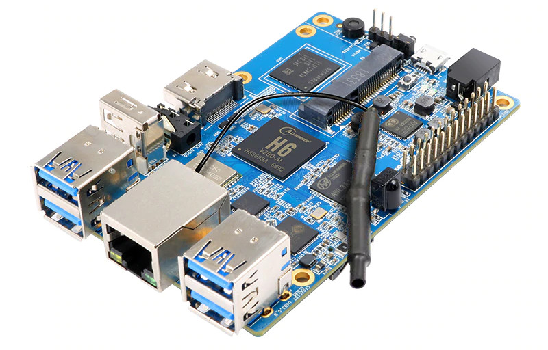

Install Quadrans on Linux
======================

**gqdc** is available for all Linux distirbutions on [Quadrans Repository](https://repo.quadrans.io/linux/) for x86, x86-64, arm7 and arm64 architecture.

You can use the [Quadrans Installer script](#self-installing-go-quadrans-binary-via-quadrans-installer), make a [manual installation](#manual-installations) using the *gqdc binary* or by [compiling the source code](#manually-build-go-quadrans-from-source).

## PC Computer/Server requirements

**Quardans** is an high efficiency blockchain but suggests to use a dedicated Computer/Server for production and a maximum uptime for Nodes, Miner or Masternodes.

**Minimum system requirements:**

* Computer Desktop, Server or Virtual Machine
* 2 Core 32bit CPU
* 2 GB RAM
* 50 GB storage

**Suggested requirements:**

* Computer Desktop, Server or Virtual Machine
* 2 Core 64bit CPU
* 4 GB RAM
* 100 GB storage

## Small Computer Module

**Quadrans** is an high efficiency blockchain and could work without problems on Small Computer Module like Raspberry, Orange Pi, RockPi, etc. The Quadrans Team tested some of these hardware but you can use the Quadrans node (arm7 or arm64) on any SCM. It is important to understand that you must use an high quality storage (microSD card or external USB hard drive) and a good heatsink.

### Raspberry Pi
#### What is Raspberry Pi

The [Raspberry Pi](https://www.raspberrypi.org) is a low cost, credit-card sized computer developed by [Raspberry Pi Foundation](https://www.raspberrypi.org). It can run Linux operating system. Recent models use [Broadcom](https://en.wikipedia.org/wiki/Broadcom_Inc.) SoC, and could have 1, 2 or 4 GB of RAM.


#### Raspberry Pi requirements
**Quadrans Technical Team** tested the [arm7 binary](http://repo.quadrans.io/arm/arm7/) (32bit) in combination with [Raspberry OS](https://www.raspberrypi.org/software/) operating system with the Raspberry devboards.

Models tested are:

* Raspberry Pi 4
* Raspberry Pi 3 Model B+

#### Suggested Operating System
* [Raspberry OS](https://www.raspberrypi.org/software/) (32 bit)
  * Installation guides are available in the [official Raspberry website](https://www.raspberrypi.org)
* [Ubuntu](https://ubuntu.com/download/raspberry-pi) (64 bit)

### Orange Pi
#### What is Orange Pi

The [Orange Pi](https://www.orangepi.org/) is an open-source single-board computer developed by [Shenzhen Xunlong Software CO.](https://www.orangepi.org/). It can run Android 4.4 or Linux. Recent models use the [Rockchip](https://en.wikipedia.org/wiki/Rockchip) RK3399, [AllWinner Technology](https://en.wikipedia.org/wiki/Allwinner_Technology) H6 SoC, and could have 1, 2 or 4 GB of RAM.



#### Orange Pi with Rockchip RK3399

**Quadrans Technical Team** tested the [arm64 binary (64 bit)](http://repo.quadrans.io/arm/arm64/) in combination with [official Ubuntu Image](http://www.orangepi.org/html/serviceAndSupport/index.html) operating system with these devboards:

* Orange Pi 4

#### Orange Pi with AllWinner H6 SoC

**Quadrans Technical Team** tested the [arm64 binary (64 bit)](http://repo.quadrans.io/arm/arm64/) in combination with [Armbian for Orange Pi](https://www.armbian.com/download/?tx_maker=xunlong) operating system with the AllWinner H6 devboards.

Models tested are:

* Orange Pi 3
* Orange Pi One Plus
* Orange Pi Lite 2

#### Orange Pi with other SoC

**Quadrans Technical Team** tested the [arm7 binary (32 bit)](http://repo.quadrans.io/arm/arm7/) in combination with [Armbian for Orange Pi](https://www.armbian.com/download/?tx_maker=xunlong) operating system with these devboards:

* Orange Pi Zero Plus

## Self-installing go-quadrans binary via Quadrans Installer

This bash script allows you to install or update your node for any Linux distributions on any CPU architecture (x86, x86-64, arm7 and arm-64).

Simply digit this command on your Terminal/Console:

``` bash
wget http://repo.quadrans.io/installer/gqdc-installer.sh
sudo bash gqdc-installer.sh
``` 

The installation process will ask for a *node name* and a *password* if you want to create a wallet to became a Quadrans Miner or Masternode.

This tool allow you to update your node if needed, switch from Mainnet to Testnet, uninstall and recover a previous installation.

## Enable your node for mining

Go to [Mining and Reward](../../cryptocurrencies/mining_and_reward) chapter of this Wiki.

## Manually build go-quadrans from source

Please refer to the guide [build go-quadrans from source](../build/source-code) to compile the binary from the source code.

## Manual installations

After downloading the gqdc binary from [Quadrans Repository](https://repo.quadrans.io/linux/), make it executable and run `gqdc` to connect your node to the Quadrans Network. Make sure to check the different options and commands with `gqdc --help`

To create a new Quadrans wallet put a password inside a text file and execute the following command:

``` bash
gqdc account new --password Your_Password_File.txt
``` 

To set a different data directory:

``` bash
gqdc --datadir datadir_path
``` 

To show your node in the Quadrans Network Status page:

``` bash
gqdc --ethstats "Your Node Name":QuadransStatsNetwork@status.quadrans.io:3000
``` 

To execute the node as a *Miner* choose a name for your node, use the previous created wallet and the password file in this way (substitute *0xYour_Wallet_Address*, *Your_Password_File.txt* and *Your Node Name* with your information):

``` bash
gqdc --mine --unlock 0xYour_Wallet_Address --password Your_Password_File.txt  --ethstats "Your Node Name":QuadransStatsNetwork@status.quadrans.io:3000
``` 

It is important to understand that to use a node as Miner or Masternode you need to follow this chapter [Mining and Reward](../../cryptocurrencies/mining_and_reward)

To connect to Quadrans Testnet (download the [last test Quadrans node binary](../management/testnet)).

## Connect the node to Testnet 

Please read the [How to setup your node for testnet](../management/testnet) documentation.

### Important

You can move from **Testnet** to **Mainnet** at any time but **you can\'t connect to the two networks at the same time**.