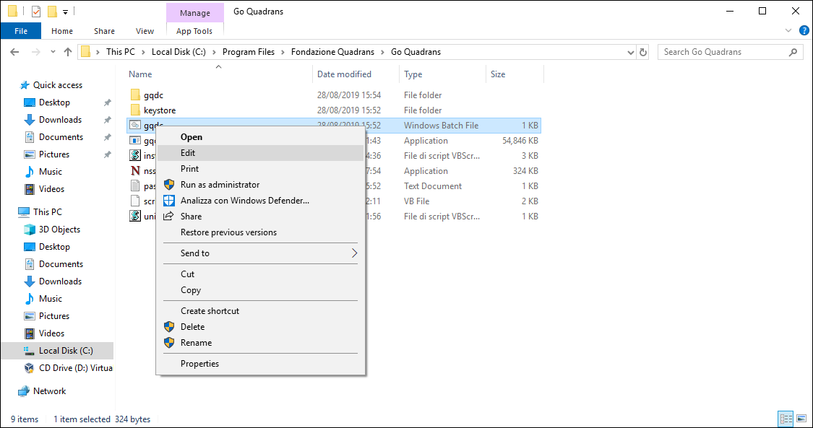

Install Quadrans on Windows
========================

**gqdc.exe** executable is available for Windows on [Quadrans Repository](https://repo.quadrans.io/windows/) for i386 and amd64 architecture.

You can make a [manual installation](#useful-options-for-manual-installations) using the *gqdc binary* or by [compiling the source code](#manually-build-go-quadrans-from-source).

## Hardware & Software requirements

**Minimum system requirements:**

* Computer Desktop
* Windows 7/8/10/11
* 2 Core 32bit CPU
* 2 GB RAM
* 50 GB storage

**Suggested requirements:**

* Computer Desktop, Server or Virtual Machine
* Windows 7/8/10/11 or Windows Server 2012/2016/2019
* 2 Core 64bit CPU
* 4 GB RAM
* 100 GB storage

## Self-installing go-quadrans binary via Quadrans Batch Installer [Beta]

This batch script allows you to download the Quadrans node on Windows and easily configure a Launcher to execute.

Simply digit this command on your **Command Prompt**:

``` batch
curl -s https://repo.quadrans.io/installer/gqdc-winstaller.bat -o gqdc-winstaller.bat
gqdc-winstaller.bat
``` 

Or digit this command on your **PowerShell**:

``` batch
Invoke-WebRequest -Uri https://repo.quadrans.io/installer/gqdc-winstaller.bat -OutFile gqdc-installer.bat 
.\gqdc-winstaller.bat
``` 

The installation process will ask for a *node name* and a *password* to create a wallet to became a Quadrans Miner or Masternode.

Follow the simple instruction.

## Enable your node for mining

Go to [Mining and Reward](../../cryptocurrencies/mining_and_reward) chapter of this Wiki.

## Manually build go-quadrans from source

Please refer to the guide [build go-quadrans from source](../build/source-code) to compile the binary from the source code.

## Go Quadrans self installer for Windows (**discontinued**)

*Go Quadrans self installer for Windows is actually not supported. A new version will be relased in the second half of 2022.*

Quadrans Node installer is available for Windows 7, Windows 8 and Windows 10 desktop operating system, and Windows Server 2008, Windows Server 2012 and Windows Server 2016.

After you download the correct version for your processor architecture, you can run the \*\*Go Quadrans Setup Wizard\*\* to install the node on your computer.


Select the prefered language, click **Next** and than click again on **Next** in the Welcome screen.


Please **Accept** the License Agreement ([GNU GPL v3](https://www.gnu.org/licenses/quick-guide-gplv3.html)) to proceed with the installation.


Please select which network to connect to:

* **Mainnet**: is the Quadrans main blockchain.
* **Testnet**: is the testing environment of Quadrans blockchain. Users can trial their new decentralised applications (DApps) under different conditions and conduct analysis before moving to Quadrans main network. Quadrans Coins used in Testnet are easy to obtain and are a replica used exclusively for testing . Please connect to Testnet only for the intended use.


Answer **Yes** if you want to be listed on the [Quadrans Status page](https://status.quadrans.io) and give a name to your node (for example the name of your company) to allow the basic information related to your node to be publicly visible.


During the setup the installer allows to create a wallet for **Quadrans Coin** linked to your node.

If you want to create a Quadrans wallet, select **Yes** and choose a password. We suggest to choose a random password with at least 16 digits.

Setting up a wallet is not mandatory, however you can use Quadrans wallet to collect the reward for your contribution as a Miner or Masternode or to identify your transactions on Quadrans blockchain.


You can choose the type of Node you want to install. To enable the mining functions of a Miner and a Masternode you need to pair your Node with a wallet that contains a certain number of Quadrans Tokens ([please refer to the Quadrans Community registration](https://quadrans.io/get-started)).

* **Node**: it is a computer in the blockchain network that contains a copy of the database, structured in blocks. By joining the Quadrans blockchain, you help ensure and certify that the complete history of transactions stored in the blocks are part of the distributed database. By installing a node you contribute to the expansion of the network and can start entering data into the Quadrans blockchain.
* **Miner**: it is a node of the network that actively contributes to the safety of the infrastructure. *To enable a node to the basic mining functions it is necessary to have a minimum of 1000 Quadrans Tokens*.
* **Masternode**: it is a node that performs special and highly rewarded computational tasks within the network, such as validating the blocks of the blockchain. A Masternode also distributes the work to the Miners in the network and are fewer in number than Miners. *To enable a node to the Masternode mining functions it is necessary to have 100.000 Quadrans Tokens*.


Please select the folder where you want to install the Quadrans Node and click **Next**. Inside this folder you will find the configuration files, the wallet key (if you created one) and all the blockchain data, so please select a disk that meets the [minimum system requirements](#hardware_software_requirements).


In the new window please click **Install** to complete the Go Quadrans installation in your computer.


If you choosed to create a Quadrans wallet you can copy and paste the public address from the last setup screen. Click **Next** to end the setup procedure.

### Enable your node for mining

Go to [Mining and Reward](../../cryptocurrencies/mining_and_reward) chapter of this Wiki.

### Backup your configuration, wallet private key and password

Important data regarding your node is stored in the installation folder.


Please open you installation folder, select **keystore** folder, `gqdc.bat` and `password.txt` files and copy to a safe location.

* **keystore folder**: it contains the private key of your wallet
* **gqdc.bat**: it contains the configuration of your node (name, linked wallet address, etc.)
* **password.txt**: in contains the unlock password of your wallet

### Identify your Quadrans Coins wallet address

To check your wallet address please open your **installation folder** (default is: `c:\\Program files\\Fondazione Quadrans\\Go Quadrans\`) and select the `gqdc.bat` file.



Please right click on gqdc.bat file and select **Modify**.


You will see your Quadrans Coins wallet address after the *unlock* parameter, as shown in the image above.

## Uninstall Go Quadrans from Windows 10

To remove Go Quadrans from your Windows 10 computer go to Start Menu, select the Go Quadrans folder, right click on the Go Quadrans app icon and select **Uninstall**.


Windows will open the list of your installed app. Select Go Quadrans and click **Uninstall**.


At the end of the uninstallation please reboot your system.

### Uninstall Go Quadrans from the installer

You can also uninstall Go Quadrans directly from the installer. Double click on the Go Quadrans installer and go on the Modify, Repair or Remove installation window. Please select **Remove** to uninstall Go Quadrans.


At the end of the uninstallation please reboot your system.