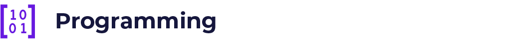

.. raw:: html

   

Programming
===========

.. raw:: html

   

Guides
******

Quadrans is fully interoperable with any data flows and ensures compatibility and transferrable features with Ethereum and Ethereum-like ecosystems to allow a seamless and immediate transition of existing solutions into the Quadrans blockchain.

.. toctree::
   :maxdepth: 2

   /programming/native-bindings
   /programming/solidity_101
   /programming/web3

Tests
*****

.. toctree::
   :maxdepth: 2

   /programming/test-echo

