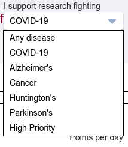

Use Folding\@home with Quadrans team 
====================================

## What is Folding\@home and why Quadrans join its Covid-19 studies? 

[Folding\@home](https://foldingathome.org) is a distributed computing project, that very simply stated, studies protein folding and misfolding. Due to the coronavirus pandemic the project has focused priority on research specific to the coronavirus. Everyone with a
computer can be a part of the research by downloading the **FAHclient** and contribute to research.

From 8:00 AM (CET) of November 13, 2021 the Quadrans Foundation will no longer accept new registrations on the Folding@home initiative.

## Install Folding\@home for Windows

Download and install the latest **FAH Installer** for Windows version (32 and 64 bit) from the [official download page](https://foldingathome.org/alternative-downloads/).

The installer for Windows includes in one package:
 * **FAHclient**: the Folding@home core with the Web Control to configure it;
 * **FAHcontrol**: the GUI to configure the client with advanced options;
 * **FAHviewer**: a work unit viewer with different rendering options. the FAHclient, FAHcontrol and FAHviewer.

Follow the simple steps on the screen. For default settings click
*Yes*, *Next*, *I Agree*, *Next* and *Finish*.

At the end of the process the FAH Web Control will open in your web browser and please follow the configuration instructions below.

## Install Folding\@home for Mac

Download and install the latest **FAH Installer** for Mac OS version (10.7+ 64 bit) from the [official download page](https://foldingathome.org/alternative-downloads/).

The installer for Mac includes in one package:

* **FAHclient**: the Folding@home core with the Web Control to configure it;
* **FAHcontrol**: the GUI to configure the client with advanced options;
* **FAHviewer**: a work unit viewer with different rendering options. the FAHclient, FAHcontrol and FAHviewer.

Follow the simple steps on the screen. For default settings click
*Continue*, *Continue*, *Agree*, *Continue* and *Install*.

At the end of the process the FAH Web Control will open in your web browser and please follow the configuration instructions below.

## Install Folding\@home for Linux

Download and install the latest FAHclient for your Linux distribution (64 bit only) from the [official download page](https://foldingathome.org/alternative-downloads/).

Alternatively, you can verify the availability in your *Package Manager*.

Linux version is available in a modular installation:
* **FAHclient** (mandatory) is the Folding@home core with the Web Control to configure it;
* **FAHcontrol** (optional) is the GUI to configure the client with advanced options;
* **FAHviewer** (optional) is a work unit viewer with different rendering options.

At the end of the process verify from a Terminal window that the service is enabled and started.

``` bash
sudo systemctl status foldingathome
```

If the **foldingathome** service is not *Active* start it.

``` bash
sudo systemctl start foldingathome
```

## Configure your FAHclient to work with Quadrans team 

A the end of the installation process, open your web browser and go to the [Local Folding\@home Web Control panel](https://client.foldingathome.org/).

This will open a web page tha allows to setup your **FAHclient**.

### Set up an identity

On the **Welcome to Folding\@home** screen please select **Set up an identity** before pressing the *Start Folding* button.

This is mandatory, Anonymous users will receive less units to work from Folding\@home and _will not be able to receive the additional Quadrans Tokens_ as reward for your partecipation.


### Obtaining a Passkey

Before proceding, [register your name and e-mail](https://apps.foldingathome.org/getpasskey) to receive a **Passkey** from Folding\@home.

For Quadrans team is mandatory that the Name is the **Ethereum wallet address registered in the Quadrans KYC**. You can verify what is this address in the **Quadrans Token Portal** on the *Settings* page in the *Account* dropdown menu.


You will receive your Passkey in your mailbox.

### Configure your identity

To complete the setup in the **Change Identity** window please insert your **Ethereum wallet address registered in the Quadrans KYC** as Name, **245335** as Team Number and your **Passkey**.


Than click **Save**.

### Select your research purpose (optional) 

From the dropdown menu below *I support research fighting* you can select the specific research you want to contribute to.



Quadrans Team works for COVID-19 research.

### Configuration completed

Your Folding\@home installations is ready to work together with all the users in the Quadrans Team.

## How the Power slider works

The **Power slider** allows o select how much power of your computer will be used from Folding\@home.


The slider has three positions for allocated power:

* **Light:** CPU is Folding at half speed, GPU Folding is off.
* **Medium:** CPU is Folding at three-quarter speed. GPU Folding is on. This is the default setting, and recommended for most users.
* **Full:** CPU is Folding at full speed. GPU Folding is on. This is the most productive setting. Will cause fans to run faster and may produce more heat.

And two running options:

* **While I’m working:** Folding is enabled to run at all times, based on the slider position.
* **Only when idle:** Folding starts only when the system has not been used for several minutes.

## What is the reward for the Folding\@home work?

From 8:00 AM (CET) of November 13, 2021 the Quadrans Foundation will no longer accept new registrations on the Folding@home initiative. For all members already enrolled in the Quadrans Folding@home team, the Foundation will extend the time to complete their work until December 31, 2021.
