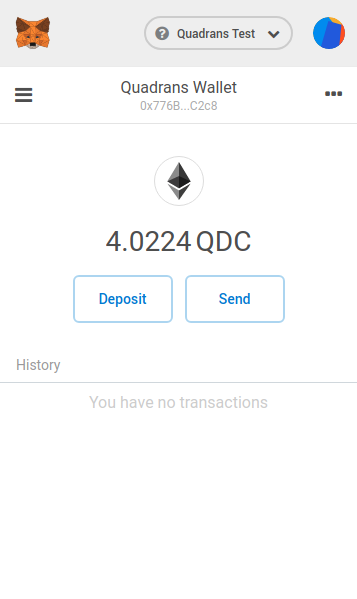
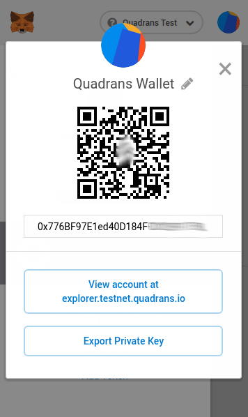
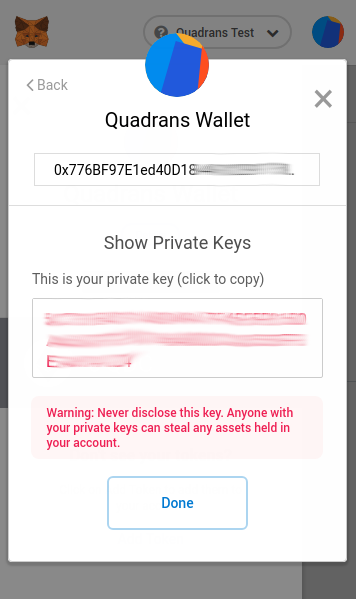

Using MetaMask wallet with Quadrans Coins
=========================================

## What is MetaMask

[MetaMask](https://metamask.io) is a browser plugin that allows users to manage wallets and make transations. MetaMask can be used for **Quadrans Coin**.

It is availble for [Google Chrome](https://www.google.com/chrome/), [Mozilla Firefox](https://www.firefox.com) and [Opera](https://www.opera.com) web browsers.

MetaMask extension for your browser:

* [Get MetaMask for Google Chrome](https://chrome.google.com/webstore/detail/nkbihfbeogaeaoehlefnkodbefgpgknn)
* [Get MetaMask for Mozilla Firefox](https://addons.mozilla.org/en-US/firefox/addon/ether-metamask/)
* [Get MetaMask for Opera browser](https://addons.opera.com/it/extensions/details/metamask-10/)

## Automatically connect to Quadrans

Quadrans team developed a simple tool that allows you to configure your MetaMask wallet to work in the Quadrans Blockchain with one simple click.

Go to [https://connect.quadrans.io](https://connect.quadrans.io) and select *Connect to Mainnet* or *Connect to Testnet* to setup your MetaMask.
## Manually connect to Quadrans

Otherwise it is possibile to manually configure your Network configuration in MetaMask following this simple steps.
### Settings for Quadrans Mainnet

To manage Quadrans Coins users must create a new Network configuration in MetaMask.

Go to Account menu, click on Settings and on Networks, select **Add Network** and add the following information:

* Network Name: **Quadrans**
* New RPC URL: **https://rpc.quadrans.io**
* ChainID: **10946**
* Symbol: **QDC**
* Block Explorer URL: **https://explorer.quadrans.io**

Click **Save** to confirm.

### Settings for Quadrans Testnet

To manage a Quadrans Wallet in testnet users must add a secondary Network configuration in MetaMask.

Go to Account menu, click on Settings and on Networks, select **Add Network** and add the following information:

* Network Name: **Quadrans Test**
* New RPC URL: **https://rpctest.quadrans.io**
* ChainID: **10947**
* Symbol: **tQDC**
* Block Explorer URL: **https://explorer.testnet.quadrans.io**

Click **Save** to confirm.

## Create a new Quadrans wallet

**Attention:** If you intend to install a Quadrans node please ignore this step: your node will ask to create a new wallet during the installation process and if you want to transfer your Quadrans Coin please follow the [Import your Quadrans node wallet](#import-your-quadrans-node-wallet) step.

It's important to understand that the first wallet created in MetaMask is compatible only with Ethereum blockchain.

After you added Quadrans Mainnet or Testnet network select one and click on the icon on the top right of MetaMask interface, in the new menu press **Create Account**.

The **New Account** window will appear. Give a name to your new wallet, click **Create** 

**Quadrans wallets for Mainnet or Testnet are usable in both networks**. Simply change the network to see the two balances.

### Backup your wallet Private Key

Click on the menu button below the MetaMask fox icon and click on Details.

In the new window click on Export Private Key, when asked insert your MetaMask password and copy the private key in a safe place.

## Import your Quadrans node QDC wallet

After you added Quadrans Mainnet or Testnet network select one and click on the icon on the top right of MetaMask interface, in the new menu press **Import Account**.

The **Import Account** window will appear. Select JSON File as Type ad choose your *UTC-\** file of your wallet from [your backup](../address/storage), type the password and press **Import**.

 **Quadrans wallets for Mainnet or Testnet are usable in both networks**. Simply change the network to see the two balances.

### Important note for Windows user

If you encounter a *Wrong Password* error in MetaMask when importing the wallet via JSON File with password.txt (only files created with the Go Quadrans Windows Installer or the gqdc-winstaller.bat) please add a "whitespace" character (simply press the *spacebar* on your keyboard) to your password as last digit.